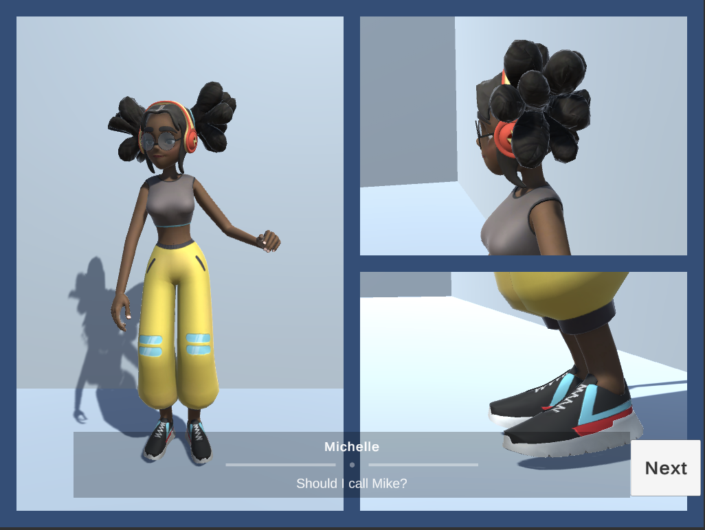

# Yarn Timeline / Cartoon strip / Interaction Proof of Concept

# Setup Notes
The background color is the main camera has culling mask set to nothing and a solid color set in its clear flags. Each cartoon strip is a camera with a pixel rect setup using the CameraGridEditor editor script.

On a timeline there are playables to tween or just set the camera grid.
Also on a timeline is the Virtual Camera override. You could disable these cameras if you dont want them being evaluated in normal play time. Then the timeline track will take over while a timeline plays.

Timelines are asssigned to the YarnSceneDirector manually in the editor inpector and then triggered in the Yarn script with \<\<playTimeline {TIMELINE_GAME_OBJECTNAME}}\>\>

I've setup the timeline with a signal that calls the touch manager to reset the Rects when a timeline starts, see the signal track with the "CameraRefreshSignal" event

####Layers
__Touchcast:__ Physics objects that are raycast positions for the touch interaction
__PhysicsInteration:__ Physics objects that can interact and also bone colliders interact with these
__Cam{x}VCams:__ For Cinemachine to ignore a virtual camera the virtual camera needs to be asigned to a layer and then the brain camera culling mask have that layer removed

####Tags
__GridCamera:__ So that it doesn't get tagged as the main camera

# Assets
Michelle model and animations from [Mixamo](https://www.mixamo.com/#/) modified in Blender with some interactable bones. Secondary motion provided by [EZSoftBone](https://github.com/EZhex1991/EZSoftBone)